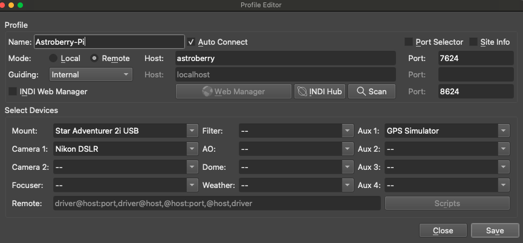
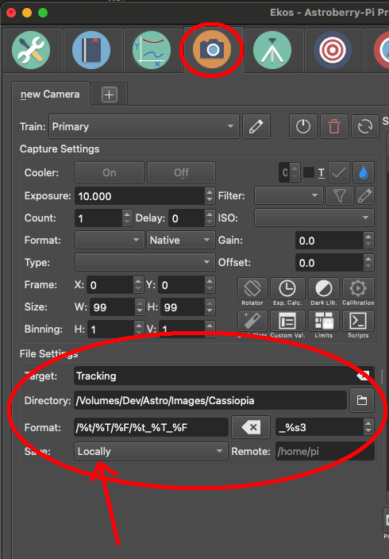
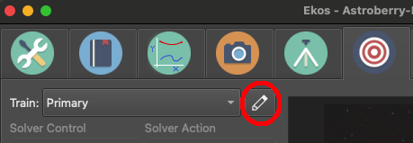
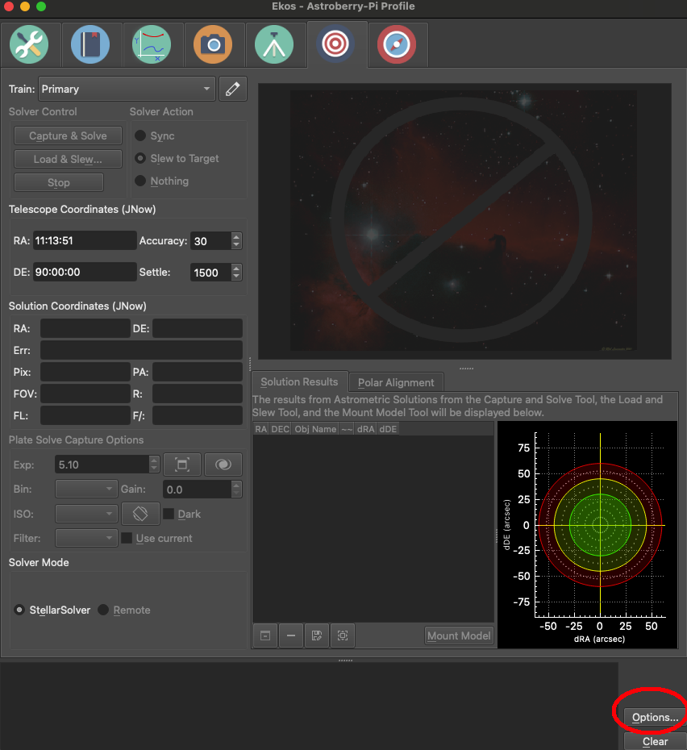
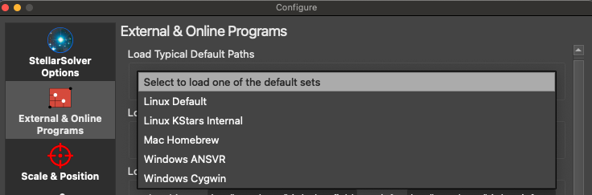
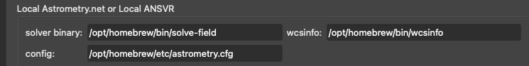
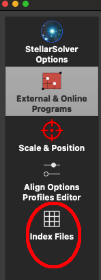
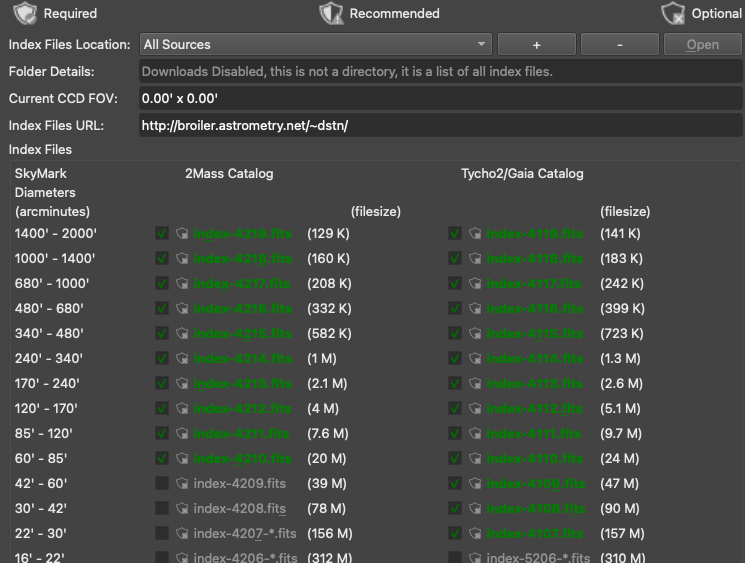
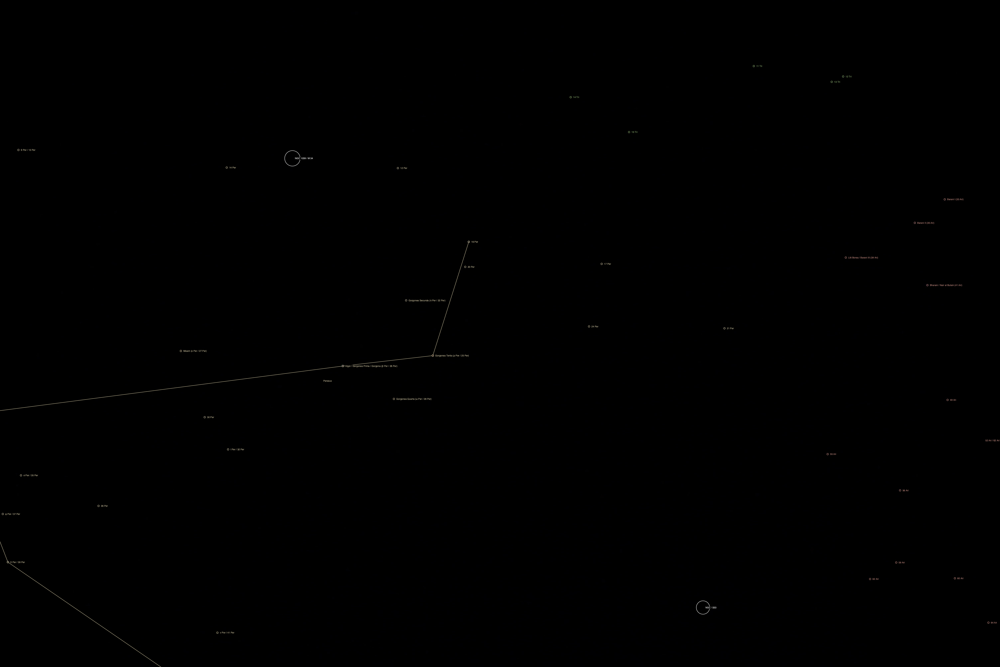

# My Indi Workflow for beginners astro photography

These are some files I have written - to try and improve my astro-photography session. 

I started off, not liking KStars at all, but - the more I use it, the better it keeps getting. 


## Startup process

I will assume everything is turned **off** and **unplugged**.

   - Remote Machine
     - Plug in all USBs (via powered USB Extension)
       - Mount
       - Camera
     - Connect Network cable (Wifi is fine also)
     - Power up
       - Turn on Mount 
       - Turn on Camera 
   - Mount 
     - Level
     - Power on
     - Polar align 
     
At this point we are done physically touching the remote equipment until finding the target is needed (non Goto-Mount), so we go inside to the AC and to escape the mosquitos.

  - Mac (or machine running KStars)
    - ssh into remote machine 
      - update datetime using **set_datetime**
      - start indi services using **start_indi_server**
  - open KStars on the Mac
    - Open EKOS 
      - Open/Create new (only needed to do 1 time) a profile 
        - Machine is remote
        - Not running indi-web-server 
        - 
        - Press *Run* Arrow 
          - Check the Devices are all connected 
          - Press OK 

We now have a remote computer - allowing us to access indi controlled devices from the comfort of our *observatory*/*couch*/*man-cave*/*woman-cave* etc 


## Remote 

There are some scripts that I use on the remote server (a Rasberry Pi). This device has the mount and camera connected to it.


```  
gps.sh
home.nmea
set_datetime.sh
start_indi_server.sh
```

### set_datetime.sh 

A simple script that you run - it will ask you for the root password, just enter it - and it will update the date-time. 


### start_indi_server.sh 

This checks to see if **indiserver** is running, and if it is - it will tell you how to **manually** stop it. 

If **indiserver** is not running, it will start it and then make connections to

  - Nikon DSLR 
  - Fake GPS (see below)
  - Mount (also a fake mount)

### FakeGPS

The indi system comes with a fake_gps simulator - called **indi_simulator_gps** - however it is hard coded to being some place you are not.... 

Now you can update *some* indi parameters from the command line (alledgedly) which is what *gps.sh* tries to do ... except that these values are hard coded, and can not be changed !!!

The solution was to modify the source code, and to update that. Re-compile and copy just the modified *indi_simulator_gps* to the */usr/local/bin* directory.


## KStars 

These are some things I have eventually discovered - which I hope will make using KStars easier for you.


## Where to save the Images ?

I do not save anything on the remote machine - Why ?? it is a Rasberry Pi, with a 32Gb SD card. It is not built to handle large amount of data - that is why we are on a network. 

So in KStars -> Ekos -> Camera(CCD)



Note: I am saving locally (Machine running KStars) 
I have also picked a directory called **Tracking** (it will create this for you) 
in the Folder for *Images/Cassiopia*. 

### What Image formats to save ?

On my **NIKON** I save in **RAW** for darks/lights etc 
But when I am trying to get the composition - I use **JPG** and **medium** quality (it is a faster file transfer).

## Plate Solving 

Yes you can plate solve with a DSLR !! **BUT** you need to have done a few things first.

So in KStars->EKOS->Plate Solving  check the profile  

You need to ensure that the **Camera** and **Lense** are defined. Why ? The Plate solver needs to know the size in mocrons of each sensor pixel, and the width in arc-minutes (for example) of the image - this is explained in the *index file* part below.

I save this setting as *Nikon_85* but you can use what ever format makes sense to you.


### Local or remote ?

I do local plate solving... and I have *astrometry.net* installed on the Mac. 

I can verify this in a command window with 

    solve-field <filename> 
    
And if there are decent stars - I 99% of the time get a result in 20s or so. 

Please note: Astrometry.net is installed in **/opt/homebrew/bin/solve-field** you can check this by using the command 

    which solve-field 
    
I need to inform KStars that I am using local *Astronomy.NET* here's how ....

 

I now pick **Mac Homebrew**

 

And I verify (using the which command shown previously) these file locations are correct 

 

### Index-Files 

Eventually we are here !!

 

KStars provides a very nice way to get the necessary index files for your plate solving. 

Think of an index-file as a data file - in which certain starts and their distance and angles from each other are calculated. Now what you can see depends (forget sky conditions) on the focal length of your scope - a C14 will be looking in much greater detail and in a smaller field-of-view (FOV) - than a 50mm lense on my Nikon camera. 

By only having the necessary indexfile - you make the plate solving process quicker and hopefully more accurate.

KStars informs you what index files would be helpful (for your DSLR(CCD) and Lense(Telescope)) combination. You just simply need to click and they will be downloaded for you.

 


### Try and PlateSolve 

So with Camera connected, Lense/CCD info in the Plate Solver - make sure the **Synch** option is selected, and now press **Capture and Solve**.

You can adjust your exposure length and ISO 


## PlateSolving externally to KStars 

This is my workflow.

We are setup as described - and we want to run a manual plate-solve

  - KStars
    - Ekos 
      - DSLR/CCD
        - Image 
          - format JPG 
          - 5s 

As we are saving locally (using earlier example) there will be an image in **/Users/tim/Dev/Astro/Images/Cassiopia/tracking/Light**  - We set the Cassiopia and tracking folders, KStars added the Light.

The image is called *Tracking_Light_005.jpg* - again due to the filename abbreviations */%t/%T/%F/%t_%T_%F* 

So to manually plate solve I do

    solve-field --overwrite Tracking_Light_005.jpg 
    
I quickly see success 

```
simplexy: found 191 sources.
Making source extraction overlay plot -- pnmfn = /tmp/tmp.ppm.MWbaXX
Solving...
Reading file "./Tracking_Light_005.axy"...
  log-odds ratio 446.646 (9.45799e+193), 113 match, 2 conflict, 64 distractors, 214 index.
  RA,Dec = (45.324,37.2958), pixel scale 14.5109 arcsec/pix.
  Hit/miss:   Hit/miss: -++++-+++++++c+----++++-++-+---++++-++-++--++-+++-+++++-+++++++-+++++----++++-+++-+-++-c+++-+-+++++-
Field 1: solved with index index-4114.fits.
Field 1 solved: writing to file ./Tracking_Light_005.solved to indicate this.
Field: Tracking_Light_005.jpg
Field center: (RA,Dec) = (45.330502, 37.298584) deg.
Field center: (RA H:M:S, Dec D:M:S) = (03:01:19.321, +37:17:54.901).
Field size: 23.9096 x 16.1047 degrees
Field rotation angle: up is 97.6857 degrees E of N
Field parity: neg
```

And in the directory I now see more files 

A useful file is the *ngc* image 



This shows you the objects that were found/placed in the image. 

But this file is a PNG and image format file. There are also some others specifically some FITS,WCS files. So we can read the WCS file and extract the Centre of the image.

```python
from pysolvefield import wcsfile, AstroScript

wcf = wcsfile("Tracking_Light_005.wcs")
if wcf.process():
    print("File parsed ok")
    print(f"Equinox: {wcf.equinox} ra: {wcf.ra_deg} dev: {wcf.dec_deg}")
    scripter= AstroScript()
    scripter.SetAzAl(wcf.ra_deg,wcf.dec_deg)
    scripter.SetAzAl_Kstar()
``` 

This is my python code - you can accomplish the same in  command line this by writing a KStars script like this 


```bash
#!/bin/bash
dbus-send --dest=org.kde.kstars --print-reply /KStars org.kde.kstars.setAltAz  double:45.3012663363  double:39.3936034305
```

    chmod +x move.sh   
    ./move.sh
    
